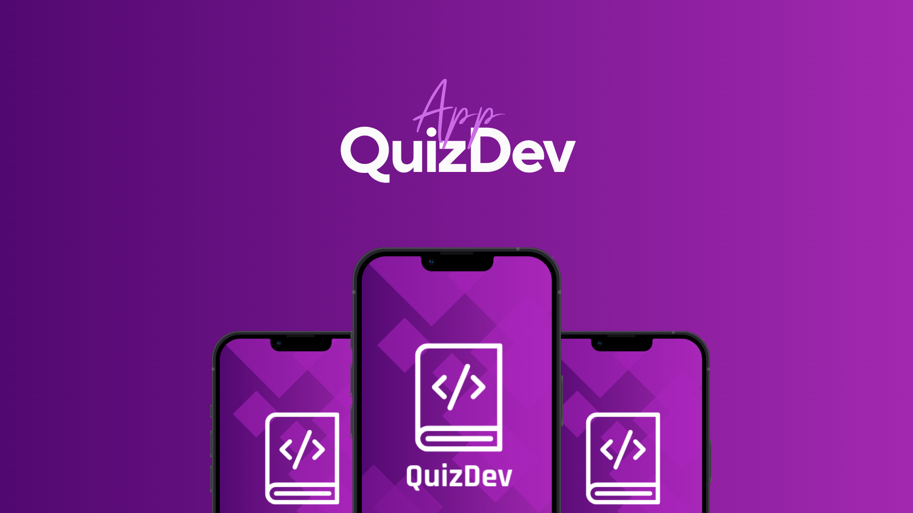
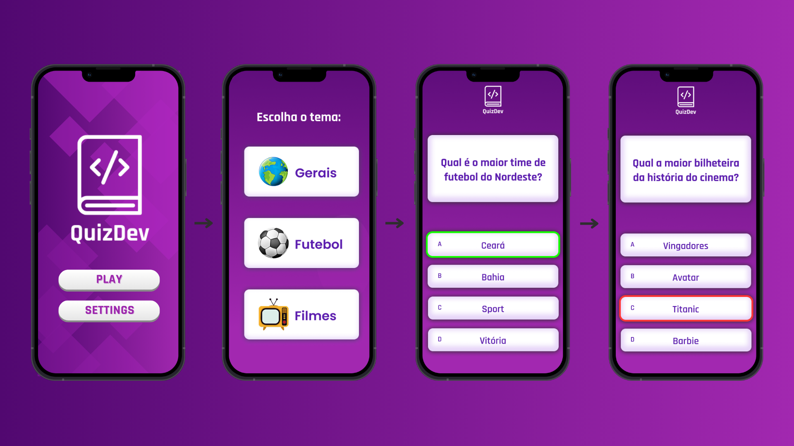

# 📱 QuizDev

<p align="center">
  
</p>

**QuizDev** é um aplicativo de quizzes interativo, desenvolvido como projeto prático do curso Técnico de Desenvolvimento de Sistemas do **SENAC CE**.  
Criado com foco no aprendizado e aplicação dos conceitos de **React Native**, o app estimula o conhecimento através da gamificação com uma experiência leve, dinâmica e divertida.

---

## 👨‍💻 Equipe

- Eike  
- Pablo  
- Matheus  

---

## 🎯 Objetivo

Aplicar na prática os conhecimentos adquiridos em sala de aula — especialmente sobre **React Native** — desenvolvendo um app mobile que promova o aprendizado por meio de quizzes temáticos.

---

## 🚀 Funcionalidades

- ✅ **Quizzes com múltiplos temas**  
  Perguntas sobre temas variados para testar seus conhecimentos.

- ❓ **Perguntas de múltipla escolha**  
  Cada tema contém perguntas com 4 alternativas, sendo apenas 1 correta.

- ⚡ **Feedback imediato**  
  O usuário recebe um retorno visual indicando se acertou ou errou.

- 🧠 **Pontuação automática**  
  O app calcula a pontuação com base nas respostas corretas.

- 📱 **Performance com React Native**  
  Fluidez e bom desempenho em diferentes dispositivos móveis.

---

## 🖼️ Demonstrações do App

<p align="center">
  
</p>

<p align="center">
  
</p>

---

## 🛠️ Tecnologias Utilizadas

- React Native
- JavaScript
- (Adicione aqui outras libs, como React Navigation, Styled Components, etc.)

---

## 📦 Como executar o projeto

1. Clone o repositório:
   ```bash
   git clone https://github.com/seu-usuario/quizdev.git
